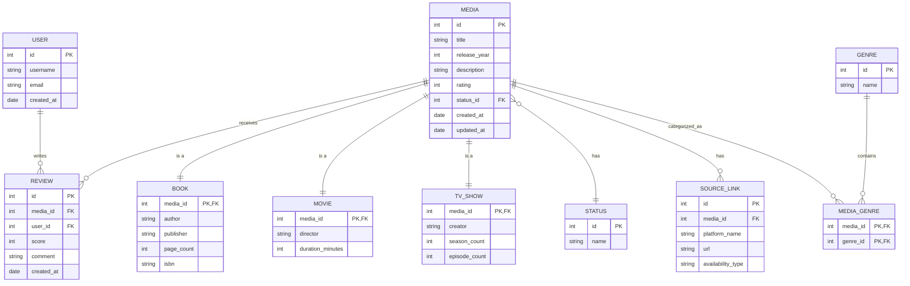

```mermaid
erDiagram
    USER ||--o{ REVIEW : writes

    MEDIA ||--|| BOOK : "is a"
    MEDIA ||--|| MOVIE : "is a"
    MEDIA ||--|| TV_SHOW : "is a"

    MEDIA ||--o{ REVIEW : receives
    MEDIA }o--|| STATUS : has
    MEDIA ||--o{ SOURCE_LINK : has
    MEDIA ||--o{ MEDIA_GENRE : categorized_as
    GENRE ||--o{ MEDIA_GENRE : contains

    USER {
        int id PK
        string username
        string email
        date created_at
    }

    MEDIA {
        int id PK
        string title
        int release_year
        string description
        int rating
        int status_id FK
        date created_at
        date updated_at
    }

    BOOK {
        int media_id PK, FK
        string author
        string publisher
        int page_count
        string isbn
    }

    MOVIE {
        int media_id PK, FK
        string director
        int duration_minutes
    }

    TV_SHOW {
        int media_id PK, FK
        string creator
        int season_count
        int episode_count
    }

    STATUS {
        int id PK
        string name
    }

    GENRE {
        int id PK
        string name
    }

    MEDIA_GENRE {
        int media_id PK, FK
        int genre_id PK, FK
    }

    REVIEW {
        int id PK
        int media_id FK
        int user_id FK
        int score
        string comment
        date created_at
    }

    SOURCE_LINK {
        int id PK
        int media_id FK
        string platform_name
        string url
        string availability_type
    }
```